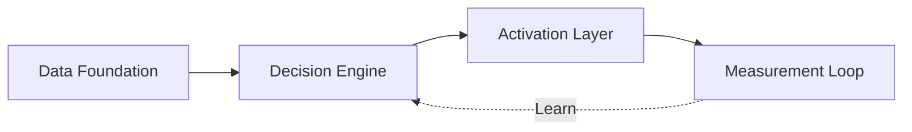

# Data & AI Advisory

Reference architectures, decision records, and case patterns for
**Decision Intelligence + Activation**. Vertical depth in Banking &
Financial Services, Retail, Consumer Packaged Goods, and Healthcare.

Authored by **Srikanth Akella** — Principal Architect with 19+ years
in enterprise data and AI. Specialization: composable CDP, agentic AI,
and the activation layer that closes the loop between decision and
revenue.

🌐 **Live site:** [sriakella.github.io/data-ai-advisory](https://sriakella.github.io/data-ai-advisory)
💼 **LinkedIn:** [linkedin.com/in/srikanthakella](https://www.linkedin.com/in/srikanthakella)

---

## The framework

Most AI content stops at the decision. This repo focuses on the
activation layer that follows — where insight becomes outcomes.

---
## Latest

| Date | Vertical | Artifact |
|---|---|---|
| 2026-06-16 | BFS | [Decision Intelligence + Activation: The Three-Verb Architecture for BFSI](./bfs/2026-06-16_bfs_reference-architecture_di-activation-substrata.md) |
---
## Index

| Vertical | Focus |
|---|---|
| [BFS](./bfs/) | Next-best-action, suitability, fraud, wealth advisory |
| [Retail](./retail/) | RFM-to-activation, personalization, in-store + digital |
| [CPG](./cpg/) | Trade promotion, route-to-market, household personalization |
| [Healthcare](./healthcare/) | Adherence nudge, care pathway, payer-provider activation |
| [Cross-industry](./cross-industry/) | Frameworks that travel across verticals |
| [Frameworks](./frameworks/) | Decision Intelligence + Activation architecture |

---

## How this repo is organized

Each artifact is one of four types, declared in frontmatter:

- **Reference architecture** — diagram-led, vendor-agnostic at framework level
- **Decision record** — short, sharp, captures one architectural decision
- **Case pattern** — sanitized industry pattern from delivery experience
- **POV** — position piece, argued not just described

Filename convention: `YYYY-MM-DD_<vertical>_<pattern-type>_<slug>.md`

---

## License

Content licensed under [Creative Commons Attribution-ShareAlike 4.0](./LICENSE).
Share freely, attribute clearly, build on it openly.
