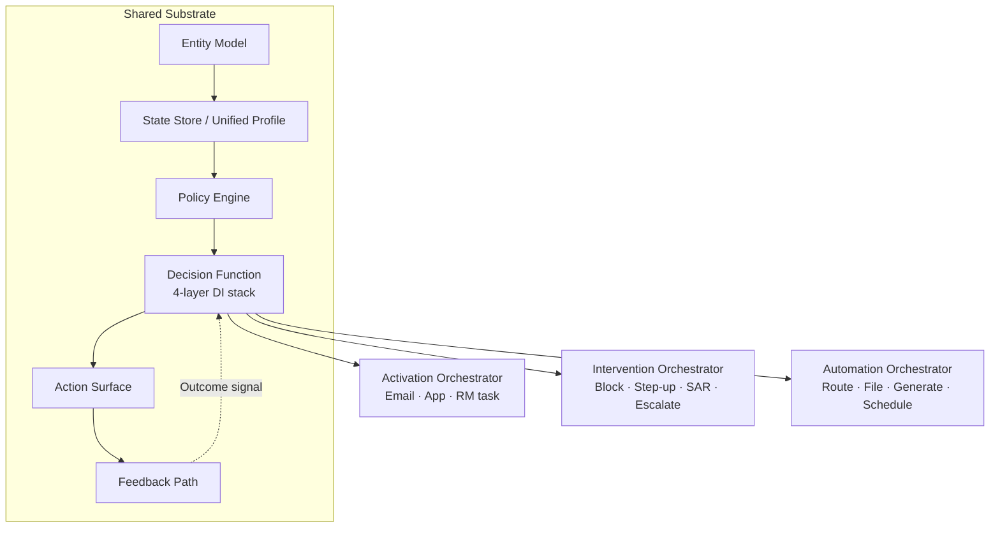

# Decision Intelligence + Activation: The Three-Verb Architecture for BFSI

## Context — the situation this addresses

Every BFSI use case — whether personalising a wealth offer, blocking a fraudulent transaction, or automating a regulatory filing — terminates in the same pipeline: unified data → identity resolution → scoring → decision → action → outcome measurement.

Most firms do not build it that way. Instead, they build vertically: a fraud platform, a marketing platform, a compliance platform, each with its own data copy, its own model layer, and its own orchestration. The result is a substrate that cannot be shared, a model inventory that cannot be governed uniformly, and an activation layer that fires in silos.

The cost is not just technical. It is strategic: the firm cannot move from "model recommends" to "action executes" at scale because the pipes between them are fractured.

This reference architecture addresses that fracture. It defines a single five-primitive substrate that supports three distinct action verbs without duplication.

---

## Position — the architectural take

Every BFSI decision function can be expressed as one of three verbs operating on a common substrate:

- **Activation** — action pushes toward the customer: offer, message, RM task
- **Intervention** — action constrains or restricts: block, step-up, SAR, escalation
- **Automation** — action executes internally: route, file, generate, schedule

The verb changes the optimisation target. The substrate does not change.

### The five substrate primitives

| Primitive | Description |
|---|---|
| **Entity model** | Resolved party graph: Customer, Household, Account, Product, Event, Decision; extended for Intervention: Transaction, Employee, Counterparty, Position |
| **State** | Unified profile — scores, exposures, signals, consent flags, relationship depth |
| **Policy** | Eligibility rules, suppression logic, fairness constraints, regulatory constraints including tip-off prohibition (AML) |
| **Decision function** | Four-layer DI stack — see below |
| **Action surface** | The write that changes the world: channel push / block / report / route |
| **Feedback path** | Outcome → model loop; closes the system and prevents score drift |

### The four-layer DI stack (same structure for all three verbs)

```
Layer 1 — Feature engineering
  Raw signals → feature vector
  (transaction history, behavioural signals, bureau data, network graph, document content)

Layer 2 — Model layer
  Feature vector → scores + eligibility flags
  (propensity models, risk scores, classifiers — vocabulary changes per verb)

Layer 3 — Decisioning
  Scores → single best action
  Priority ranker + suppression engine + action selector
  For Intervention: tip-off suppression engine is structural, not configurable

Layer 4 — Output
  Decision Record: {score, action, rationale, timestamp, audit_trail_id}
  → Orchestrator (Activation / Intervention / Automation)
```

### The DI Substrata — five rows, three verb columns

| DI Substrata | Activation (Drive Growth) | Intervention (Protect the Firm) | Automation (Improve Efficiency) |
|---|---|---|---|
| **Entity** | Customer · Household · Account | Transaction · Session · Device · Employee · Counterparty · Position | Process · Document · Queue · System · Task |
| **Feature engineering** | Transaction history · Behavioural recency/frequency · Relationship depth · Bureau features · Life event signals | Transaction velocity + amount deviation · Behavioural anomaly (login, device, location) · Device fingerprint + session pattern · Network graph (counterparty) · Exposure delta · Communication signals · Model drift metrics (PSI, KS) · Sanctions screening (real-time, not modelled) | Process state signals · Document content features · NLP/text extraction · Queue depth + wait time · Resource utilisation · Task metadata |
| **Model types** | Cross-sell propensity · Churn risk · Upsell propensity · Eligibility engine | Fraud score · AML behavioural model · ATO detector · Credit PD · Conduct anomaly · Model drift detector · Liquidity risk model | Intent classifier · Routing model · Document classifier · NLP extraction model · Forecasting (treasury, demand) · Process anomaly detector |
| **Optimises for** | Conversion / engagement — maximise expected value | Loss avoidance / compliance — minimise risk above threshold | Throughput / accuracy — minimise cost and cycle time |
| **Output routes to** | Activation orchestrator → email, app, RM task | Intervention orchestrator → block, step-up, SAR, case, escalate, regulatory report | Automation orchestrator → route, file, generate, schedule |

### Pipeline diagram



### BFSI use cases per verb

**Activation (Drive Growth)**

| Use Case | Decision Function | Action Surface |
|---|---|---|
| Hyperpersonalisation + lead management | Unified profile + NBA propensity | Email, app push, RM task |
| Loan and investment offer | Eligibility + propensity → offer generation | Digital channel + RM dispatch |
| Card payments and rewards | Spend-pattern + reward eligibility | App, statement, POS push |
| Channel optimisation | Intent prediction → routing | IVR deflection, screen-pop with NBA |

**Intervention (Protect the Firm)**

| Use Case | Decision Function | Action |
|---|---|---|
| Payment fraud | Fraud score | Block / step-up / card freeze — <300ms |
| Account takeover (ATO) | ATO detector | Step-up auth / session freeze — <500ms |
| AML / suspicious activity | AML behavioural model | SAR filing; tip-off suppression enforced |
| Credit delinquency | Probability of default model | Pre-emptive contact / limit reduction |
| Conduct risk (internal) | Conduct anomaly model | Escalation / regulatory disclosure |
| Model risk | Drift detector (PSI, KS) | Model retirement / SR 11-7 escalation |

**Automation (Improve Efficiency)**

| Use Case | Decision Function | Action |
|---|---|---|
| KYC document processing | NLP extraction + classifier | Auto-classify, extract fields, route to queue — target <30s vs 12min manual |
| Regulatory report generation | Rule engine + NLP generation | Auto-draft SAR narrative, BCBS capital return, FCA submission |
| Treasury cash optimisation | Liquidity forecasting | Recommended allocation, sweep instructions |
| Reconciliation automation | Process anomaly detector | Auto-match, flag breaks, auto-ticket |

### A note on the AML tip-off constraint

When the Intervention orchestrator triggers a SAR filing, customer notification is prohibited under FinCEN guidance (31 U.S.C. § 5318(g)(2)) and equivalent UK POCA 2002 / EU AMLD tipping-off provisions. This is not a configuration option. It is a hard structural constraint in the Policy layer. Any architecture that places suppression logic downstream of the action surface — or treats it as an alert suppression feature — is architecturally incorrect and creates regulatory exposure. The correct position: tip-off suppression fires in Layer 3 of the decision function, before any action is dispatched.

---

## Tradeoffs — what this gains, what this gives up

**What this gains**

A single substrate means a single entity graph, a single model governance process, and a single audit trail. When the same customer appears in an Activation use case (cross-sell) and an Intervention use case (fraud alert) within the same session, the substrate holds both contexts and the decisioning layer can apply appropriate suppression. Without substrate unification, these two use cases cannot communicate, and the firm risks both a missed fraud signal and an ill-timed marketing push simultaneously.

**What this gives up**

Substrate unification is a multi-year program, not a sprint. Teams that are organised by vertical (fraud team, marketing team, compliance team) will resist sharing a data layer they do not control. The architecture is correct but the implementation requires organisational alignment that is harder than the technology. Do not underestimate this.

For real-time fraud scoring and AML typology detection specifically, specialist platforms (vendor class: Actimize, SAS, Featurespace) sit upstream of this substrate and produce the scores that feed Layer 2. This architecture handles post-decision orchestration — case creation, SAR drafting, escalation routing, compliance documentation — not the real-time inference itself. Do not overstate the scope.

---

## Application notes — where this fits, where it does not

**Fits well:**
- Tier-1 and tier-2 banks building a consolidated decisioning capability across marketing and risk
- Wealth management firms where the same RM manages activation (cross-sell) and intervention (suitability review) for the same household
- Fintech scale-ups that want to encode compliance constraints into the architecture before they hit regulatory scrutiny, not after
- Any firm building an agentic AI layer on top of existing data — the substrate is the foundation the agent reads and writes to

**Does not fit:**
- Point solutions. If the mandate is "improve fraud detection only," a specialist fraud platform is faster. This architecture pays off when multiple verbs must share data.
- Greenfield data platforms with no existing entity resolution. The substrate requires a resolved identity graph. That is a prerequisite, not an output of this pattern.

---

## References — public sources only

- FinCEN, SAR tipping-off prohibition: [31 U.S.C. § 5318(g)(2)](https://www.law.cornell.edu/uscode/text/31/5318)
- UK Proceeds of Crime Act 2002, tipping-off offence: [POCA 2002 s.333A](https://www.legislation.gov.uk/ukpga/2002/29/section/333A)
- Federal Reserve SR 11-7, Guidance on Model Risk Management: [federalreserve.gov](https://www.federalreserve.gov/supervisionreg/srletters/sr1107.htm)
- FATF Guidance on AML/CFT and Financial Inclusion (2013, updated 2020): [fatf-gafi.org](https://www.fatf-gafi.org/en/publications/Financialinclusion/Aml-cft-and-financial-inclusion.html)
- Salesforce Data Cloud public documentation: [help.salesforce.com/s/articleView?id=sf.c360_a_data_cloud.htm](https://help.salesforce.com/s/articleView?id=sf.c360_a_data_cloud.htm)
- Salesforce Agentforce public documentation: [help.salesforce.com/s/articleView?id=sf.agentforce.htm](https://help.salesforce.com/s/articleView?id=sf.agentforce.htm)
- McKinsey, "The next-generation operating model for the digital world" (directional estimate on automation ROI): [mckinsey.com](https://www.mckinsey.com/capabilities/operations/our-insights/the-next-generation-operating-model-for-the-digital-world)

---

*Cross-reference: [Frameworks →](../frameworks/) for the verb-agnostic version of the four-layer DI stack applicable outside BFSI.*
