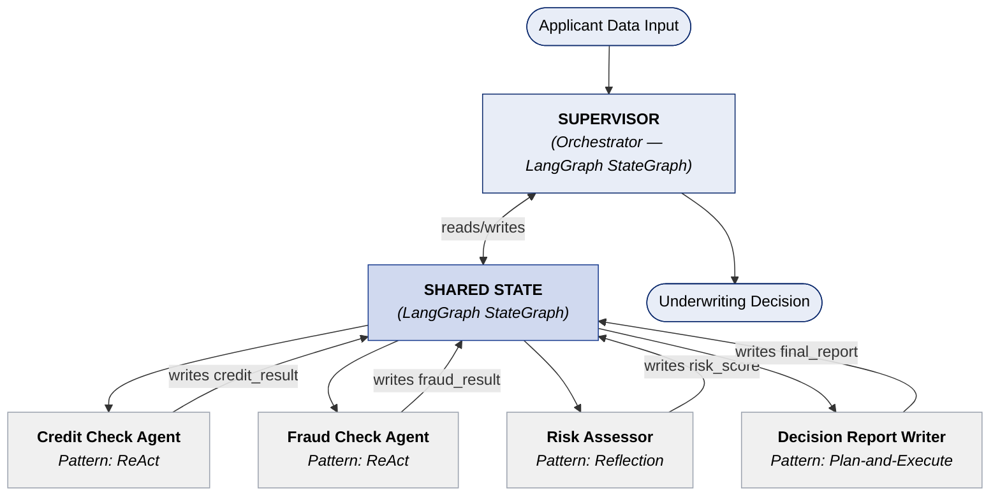

# Agentic AI Design Patterns: Supervisor Architecture with Nested Patterns
## BFSI Loan Underwriting Case Study

---

## 1. The Core Question: Pattern Selection as Architectural Reasoning

Naming a pattern is not architecture. Any engineer can read a taxonomy and attach a label. The architectural act is reasoning from workflow constraints to the topology that fits — and being able to defend that reasoning under pressure from a skeptical CDO or a platform team.

The three questions that drive pattern selection:

| # | Question | What it resolves |
|---|----------|-----------------|
| 1 | **Is the plan knowable upfront?** | If yes → Supervisor or Plan-and-Execute. If no → ReAct or dynamic orchestration. |
| 2 | **Do subtasks run in parallel?** | If yes → Supervisor (fan-out/fan-in). Sequential flow alone → Pipeline. |
| 3 | **Does the output need adversarial validation?** | If yes → embed Reflection inside the sub-agent that generates the output. |

Apply all three before committing to a topology. A system that answers "yes / yes / yes" maps cleanly to **Supervisor with nested Reflection inside the output sub-agent** — which is exactly what the loan underwriting workflow requires.

---

## 2. The Use Case: BFSI Loan Underwriting

A mid-tier consumer lending operation processes thousands of personal loan applications per day. The underwriting workflow has a fixed macro sequence but two steps that must run concurrently:

```
Applicant Data Input
    ↓
[COLLECT applicant data]
    ↓
[CREDIT CHECK] ──────── parallel ────────── [FRAUD CHECK]
    ↓                                              ↓
         [RISK ASSESSMENT] (reads both results)
                    ↓
         [DECISION REPORT] (structured output)
                    ↓
             Underwriting Decision
```

**Why this is not a Pipeline:** Credit check and fraud check are independent. Forcing them sequential wastes latency and misrepresents the domain structure.

**Why this is not pure ReAct:** The macro plan — collect, verify, assess, report — is fully knowable upfront. There is no mid-flight replanning.

**Why Supervisor fits:** The workflow has a known macro structure, parallel independent subtasks at the verification stage, and a synthesis step that depends on aggregated results. Supervisor handles fan-out, fan-in, and synthesis natively through shared state.

---

## 3. The Architecture

### 3.1 Outer Topology: Supervisor Pattern (LangGraph StateGraph)

The Supervisor is the orchestrator. There is no separate orchestration layer above it. It:

1. **Plans** the delegation sequence at initialization (collect → parallel verify → assess → report)
2. **Delegates** to sub-agents by writing tasks or signals to the shared `StateGraph`
3. **Reads** sub-agent results from `StateGraph` after each stage completes
4. **Synthesizes** and delivers the final underwriting decision

Sub-agents do not callback to the Supervisor. They write results to the shared `StateGraph`. The Supervisor reads state at defined checkpoints. LangGraph enforces the state contract through typed reducers — preventing schema drift between agents.

### 3.2 Architecture Diagram



### 3.3 Nested Patterns: Each Sub-Agent Chooses Its Own Internal Pattern

This is the architectural insight most implementations miss. The outer topology (Supervisor) and each sub-agent's internal execution pattern are **independent design decisions**. A sub-agent running inside a Supervisor can internally implement ReAct, Reflection, Plan-and-Execute, or any other pattern — the Supervisor does not know or care. It only reads the result written to state.

| Sub-Agent | Internal Pattern | Tool / API | Writes to State |
|-----------|-----------------|------------|-----------------|
| **Credit Check Agent** | `ReAct` | Credit Bureau API | `credit_result` (score, tradelines, derogatory flags) |
| **Fraud Check Agent** | `ReAct` | Fraud Scoring API | `fraud_result` (risk flags, velocity signals, identity score) |
| **Risk Assessor** | `Reflection` | None (reads state) | `risk_score` + `risk_rationale` |
| **Decision Report Writer** | `Plan-and-Execute` | Template renderer | `final_report` (structured, deterministic) |

**Pattern rationale per agent:**

- **Credit Check → ReAct:** The agent must query the Credit Bureau API, inspect the response, decide whether to query follow-on endpoints (e.g., tradeline detail if score is borderline), and terminate when sufficient data is collected. Tool-call loop with conditional branching — ReAct is the correct fit.

- **Fraud Check → ReAct:** Same structure. The fraud scoring API may return signals that require secondary lookups (device fingerprint, velocity check). ReAct handles the conditional branch without requiring a pre-specified plan.

- **Risk Assessor → Reflection:** The risk score is a judgment output — not a lookup. The agent generates a score and rationale, critiques its own output against the underwriting policy, and revises before writing to state. This is a one-agent Reflection loop, not a separate critic agent. It runs until the output meets quality criteria or hits the max-iteration guard.

- **Decision Report Writer → Plan-and-Execute:** The output is a fixed structured document (applicant summary, credit findings, fraud findings, risk tier, decision, conditions). The steps are deterministic and do not branch. Plan-and-Execute is appropriate: plan all sections upfront, execute each in order, terminate on completion.

### 3.4 Sub-Agent Internals (each agent owns independently)

Each sub-agent manages three things autonomously, invisible to the Supervisor:

- **Tool calling** — direct API invocations, schema-validated
- **Local scratchpad** — short-term working memory within a single invocation; not persisted to `StateGraph`
- **Termination signal** — the agent decides when it has sufficient output and writes final results to state

The Supervisor sees only what lands in `StateGraph`. This boundary is intentional — it prevents the Supervisor from becoming a coordination micromanager.

---

## 4. The Key Architectural Rule

> **⚠️ Architectural Constraint**
>
> The Supervisor **IS** the orchestrator — there is no separate orchestration layer above it.
>
> Sub-agents **write** to `StateGraph`. The Supervisor **reads** `StateGraph`. There is no direct callback from sub-agent to Supervisor.
>
> Nesting execution patterns inside sub-agents is **valid and encouraged**. The outer topology and the inner pattern are independent design decisions. A ReAct agent operating inside a Supervisor does not change the Supervisor's topology — it changes only that agent's internal execution model.
>
> LangGraph enforces the shared state contract through typed reducers. Schema drift between agents is a build-time error, not a runtime surprise.

---

## 5. Failure Modes

Three failure modes to design against explicitly:

**Supervisor bottleneck (single point of failure).** The Supervisor holds all orchestration logic. If it fails mid-run, the workflow has no resumption path unless `StateGraph` checkpointing is enabled. LangGraph's `MemorySaver` or `SqliteSaver` checkpointers address this — but must be configured, not assumed.

**Sub-agent context loss on handoff.** If sub-agents read from `StateGraph` rather than accepting a full context payload, they are only as good as the state schema. Underspecified state (e.g., missing applicant fields not included in the initial state write) causes silent partial execution. Enforce a complete state schema at the Supervisor initialization step, not at the first sub-agent invocation.

**Risk Assessor convergence failure.** The Reflection loop inside the Risk Assessor has no natural termination guarantee. Without a `max_iterations` guard, a borderline risk case where the agent perpetually revises its rationale will block the pipeline indefinitely. Set `max_iterations=3` and define a fallback behavior (e.g., escalate to human review) as part of the agent contract, not as an afterthought.

---

## 6. Closing

Pattern selection is a reasoning exercise, not a vocabulary exercise. The three questions — is the plan knowable, do subtasks parallelize, does output require adversarial validation — provide a decision surface that translates workflow constraints directly into architectural choice. The nested pattern insight extends this further: the Supervisor defines *how tasks are coordinated*, but each sub-agent is free to define *how it executes*. A credit check that needs conditional tool branching deserves a ReAct loop. A risk score that needs self-critique deserves a Reflection loop. Recognizing these as independent decisions, and making each one explicitly, is what separates an architectural recommendation from a pattern label.

---

## References

- LangGraph Documentation — StateGraph and Supervisor patterns: https://langchain-ai.github.io/langgraph/
- LangGraph Multi-Agent Architectures: https://langchain-ai.github.io/langgraph/concepts/multi_agent/
- ReAct: Synergizing Reasoning and Acting in Language Models (Yao et al., 2022): https://arxiv.org/abs/2210.03629
- Reflexion: Language Agents with Verbal Reinforcement Learning (Shinn et al., 2023): https://arxiv.org/abs/2303.11366
- LangGraph Checkpointing and Persistence: https://langchain-ai.github.io/langgraph/concepts/persistence/

---

*See also: [composable-cdp-activation-bfsi.md](../composable-cdp-activation-bfsi.md) — decision intelligence activation patterns for consumer finance*
